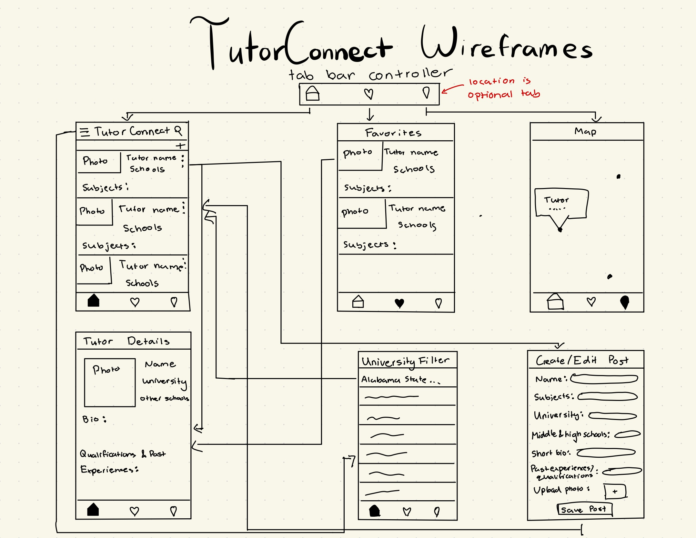

# TutorConnectApp

## Table of Contents

1. [Overview](#Overview) 
2. [Product Spec](#Product-Spec)
3. [Wireframes](#Wireframes)
4. [Schema](#Schema)

## Overview

### Description

An iOS app that helps students overcome academic challenges by easily connecting them with qualified local tutors. Users can find the perfect match based on subject expertise and school affiliation to master tough courses. At the same time, college students can easily offer their expertise, connect with younger students, and start earning money on their own schedule.

### App Evaluation
- **Category:** Education
- **Mobile:** TutorConnect is a mobile application that connects students seeking academic help with qualified local tutors. It functions as a two-sided marketplace where college students can create detailed profiles—listing their subjects, educational background, pay rate, and bio—to offer their services and earn money. Meanwhile, students and parents can easily search and filter these profiles to find the perfect match based on thie specific needs, including shared school affiliations. The integration of a map view provides a convenient way to see tutors' locations at a glance.
- **Story:** It can be hard and time-consuming for parents and students to find a qualified and relatable tutor. Simultaneously, many skilled college students seek flexible opportunities to earn money. TutorConnect solves both problems by creating a single, streamlined platform that makes it easy to find the right academic support while providing a simple way for university students to market their skills.
- **Market:** TThe target market consists of two groups: K-12 and university students (and their parents) seeking academic help, and university students looking for flexible, paid work. While the tutoring market is crowded, TutorConnect's unique value lies in its hyper-local, peer-to-peer focus. By emphasizing connections based on shared school affiliations, this app allows students to get specialized help and fosters a more trusted, accessible, and affordable learning community than larger, more generic platforms.
- **Habit:** For students, the app is used situationally—triggered by an upcoming exam or a challenging new topic. For tutors, it becomes a tool for managing their profile and availability, with usage centered around creation and maintenance. This dual-use creates a balanced ecosystem where one user's consumption (searching for a tutor) is enabled by another user's creation (building a tutor profile).
- **Scope:** This project is scoped into a clear roadmap: V1 would include the main tutor list view populated from a local JSON file. Users would be able see all tutor profiles and their details, and add profiles to their favorites. Tutors will be able to add a post advertising their skills. V2 would include a filter and search feature to allow users to narrow down the tutor list by subject, school, or other criteria. V3 would integrate a map view using MapKit to visually display tutor locations, adding a layer of geographical convenience. V4 would include a chatbox or a way to email the tutors directly from the app, or send the students profile to the tutor. V3 and V4 contain optional features to improve the app's functionality.

## Product Spec

### 1. User Stories (Required and Optional)

**Required Must-have Stories**

* [x] User can view tutor listing
* [x] User can click on tutor listing to view more details about the tutor
* [] User can add a tutor posting
* [x] User can favorite tutor profiles they like, and view their favorited profiles 

**Optional Nice-to-have Stories**

* [] User can narrow down their search with typig keywords into a search bar
* [] Users can filter based on university
* [] Users can view a map with the location of nearby tutors

### 2. Screen Archetypes

- [ ] Home Screen
* User can view a current overview of tutor profiles that are posted
* User can use a search bar to narrow their search
* Each profile displays a name, picture, subjects they tutor, their school affiliations, and their pay rates. 
- [ ] Profile Screen
* User can view more information about each tutor when a profile is clicked. 
* Displays their name, picture, subjects, university, high school, a short bio detailing their qualifications/past relevant experiences, pay rate, availability, and contact information
- [ ] Creation
* User can add a new tutor listing to the screen
- [ ] Favorites Screen
* User can view the tutor profiles they have favorited.
- [ ] Favorites Screen
* User can view a list of universities and filter the tutor listings based on university
- [ ] Map Screen
* Users can view a map with the locations of tutors that are nearby to their own location

### 3. Navigation

**Tab Navigation** (Tab to Screen)

* Home Screen
* Favorites Tab
* Map View

**Flow Navigation** (Screen to Screen)

- [ ] Home Screen
* => Creation Screen
* => Profile Screen
* => Filter Screen
- [ ] Favorites Screen
* => Profile Screen

## Wireframes

## Schema 

### Models

Tutor:
    let id: Int
    let name: String
    let profileImageUrl: String
    let subjects: [String]
    let bio: String
    let payRate: Double
    let location: String
    let university: String
    let highSchool: String
    let email: String
    let phone: String

### Networking

- [Add list of network requests by screen ]
- [Create basic snippets for each Parse network request]
- [OPTIONAL: List endpoints if using existing API such as Yelp]

### Current Progress
I have worked on setting up the initial table view on the app, created a JSON File with sample data, and displaying the data in each cell. Next Steps: Work on the aesthetic and UI of the home screen and start implementing other features. 

    
    
  

  https://www.loom.com/share/eb38835bd63c4643b6ebb3530bcccf24?sid=260f41f7-b954-4527-b93b-95398e3377f9
  
